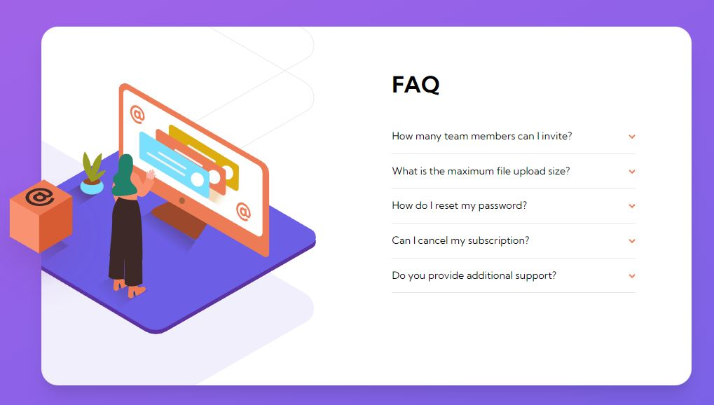

# Frontend Mentor - Order summary card solution

This is a solution to the [Order summary card challenge on Frontend Mentor](https://www.frontendmentor.io/challenges/order-summary-component-QlPmajDUj). Frontend Mentor challenges help you improve your coding skills by building realistic projects.

## Table of contents

- [Overview](#overview)
  - [The challenge](#the-challenge)
  - [Screenshot](#screenshot)
- [My process](#my-process)
  - [Built with](#built-with)
  - [What I learned](#what-i-learned)
  - [Continued development](#continued-development)
  - [Useful resources](#useful-resources)
- [Author](#author)
- [Acknowledgments](#acknowledgments)

**Note: Delete this note and update the table of contents based on what sections you keep.**

## Overview - [LIVE DEMO](https://yeongoh.github.io/)

### The challenge

Users should be able to:

- View the optimal layout for the component depending on their device's screen size
- See hover states for all interactive elements on the page
- Hide/Show the answer to a question when the question is clicked

### Screenshot

## My process

I mainly used flexbox and relative absolute positions to manipulate image locations.

### Built with

- Semantic HTML5 markup
- CSS custom properties
- Flexbox

### What I learned

I got to do more hands-on practice on DOM manipulation.

I tried to utilize picture element for mobile and desktop version of imgs.

### Continued development

### Useful resources

- [Color Gradient](https://mycolor.space/gradien) - used for background color

## Author

- Frontend Mentor - [@YeongOh](https://www.frontendmentor.io/profile/YeongOh)

## Acknowledgments
